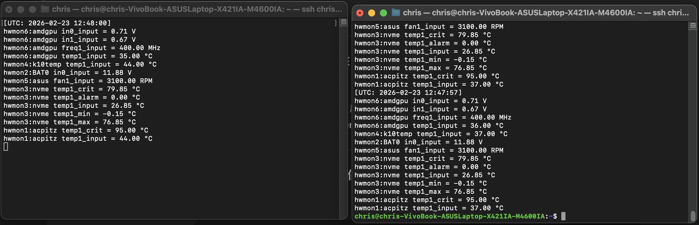

# HWMON DBus Service

A Linux-based hardware monitoring service that exposes sensor data via DBus.
The service is built as a shared library (libhwmoncore.so) and a DBus daemon (hwmon_dbus) running under systemd.

## Requirements
- Linux (systemd-based distribution)
- GCC toolchain
- DBus development libraries
- Root privileges for installation and service management

## Build & Installation

### 1. Build Shared Library
Compile the core hardware monitoring logic as a shared object:
gcc -fPIC -shared hwmon_core.c -o libhwmoncore.so

### 2. Build DBus Service Binary
Link the DBus service with the shared library:
gcc hwmon_dbus.c -L. -lhwmoncore -o hwmon_dbus -I.

### 3. Set Runtime Library Path
Ensure the shared library can be found at runtime:
export LD_LIBRARY_PATH=.

## System Installation

### 4. Install Binary
Remove any existing binary and install the new one:
sudo rm /usr/local/bin/hwmon_dbus
sudo cp hwmon_dbus /usr/local/bin/

### 5. Install systemd Service File
Install the provided systemd service file:
sudo cp hwmon.service /etc/systemd/system/hwmon.service

### 6. Reload systemd
Reload systemd to apply service changes:
sudo systemctl daemon-reload

### 7. Enable and Start Service
Enable the service to start at boot and start it immediately:
sudo systemctl enable hwmon
sudo systemctl start hwmon

### 8. Verify Service Status
Check that the service is running correctly:
sudo systemctl status hwmon

### 9. Execution / Testing

## Run for Development or Debugging
# Make sure the shared library is in LD_LIBRARY_PATH
export LD_LIBRARY_PATH=.
./hwmon_dbus

## Run for Development or Debugging
# Run the daemon
hwmon_dbus

## About
- libhwmoncore.so contains the hardware monitoring core logic.
- hwmon_dbus exposes sensor data through DBus interfaces.
- The service is designed to run as a background daemon managed by systemd.

## Platform Support
Linux: supported

## Reference
- Linux systemd service architecture
- DBus IPC mechanism
- HWMON subsystem

## Screenshots

  

